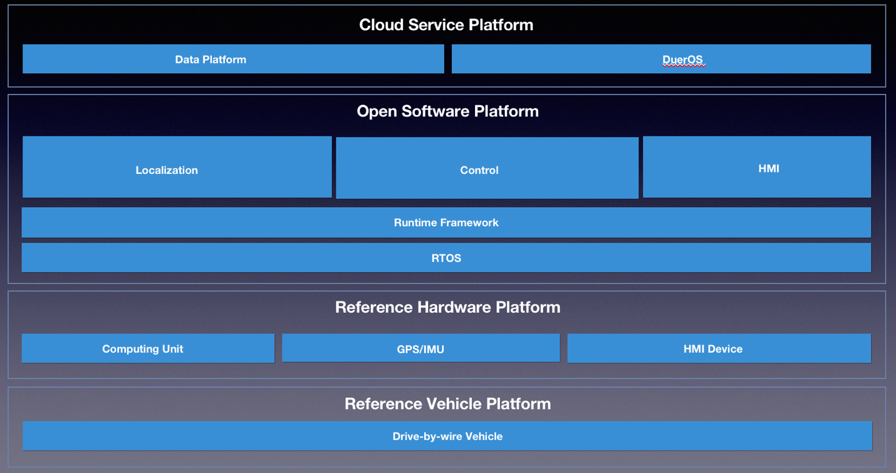
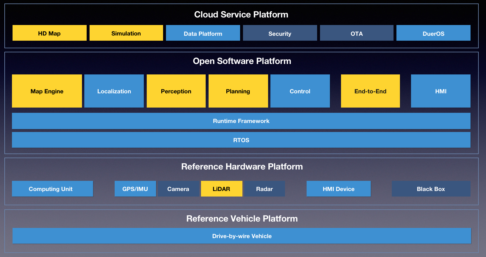
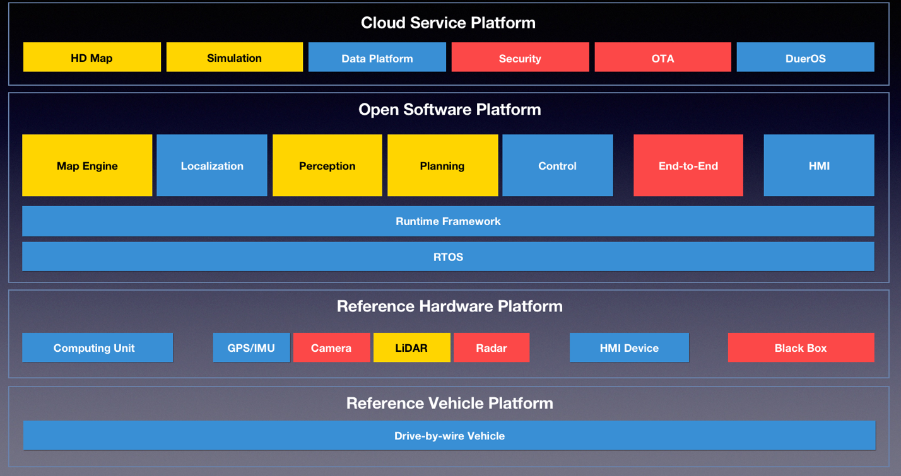

# Apollo6.0-note
百度的自动驾驶平台Apollo项目-学习

* 官方：https://apollo.auto/devcenter/idpcourse_cn.html
* github：https://github.com/ApolloAuto/apollo
* 学习中心：https://apollo.auto/devcenter/idpcourse_cn.html
* 个人笔记：https://www.yuque.com/huangzhongqing/apollo
  * 个人笔记:https://www.yuque.com/huangzhongqing/crvg1o/yggszk

**Apollo是百度的自动驾驶开源框架，根据自动驾驶的功能划分为不同的模块**

主要分为6部分：

- **高精度地图 HD Maps、**
- **定位 Localization**
- **感知 Perception**
- **预测 Prediction**
- **规划 Planning**
- **控制 Control**

- 1：高精度地图 HD Maps（High Definition Maps）
- 2：定位 Localization： 汽车定位自己位置厘米级精度自定位
- 3：感知 Perception：深度学习（CNN 分类 检测 分割）数据来源：摄像头 雷达 激光雷达
- 4：预测 Prediction： 预测其他车辆或行人可能如何移动（RNN）
- 5：规划 Planning： 将预测和路线相结合以生成车辆轨迹
- 6：控制 Control： 如何使用转向，油门，制动（刹车）来执行规划轨迹


## Apollo各部分架构

<br />

- 定位
   - [https://github.com/ApolloAuto/apollo/blob/master/modules/localization/README_cn.md](https://github.com/ApolloAuto/apollo/blob/master/modules/localization/README_cn.md)
   - 一种是结合GPS和IMU信息的RTK（Real Time Kinematic实时运动）方法，另一种是融合GPS、IMU和激光雷达信息的多传感器融合方法。
- 感知
   - [https://github.com/ApolloAuto/apollo/tree/master/modules/perception](https://github.com/ApolloAuto/apollo/tree/master/modules/perception)
- 预测
   - [https://github.com/ApolloAuto/apollo/blob/master/modules/prediction/README_cn.md](https://github.com/ApolloAuto/apollo/blob/master/modules/prediction/README_cn.md)
   - 预测模块从感知模块接收障碍物，其基本感知信息包括位置、方向、速度、加速度，并生成不同概率的预测轨迹。
- 路由
   - [https://github.com/ApolloAuto/apollo/blob/master/modules/routing/README_cn.md](https://github.com/ApolloAuto/apollo/blob/master/modules/routing/README_cn.md)
   - 路由模块根据请求生成高级导航信息。

路由模块依赖于路由拓扑文件，通常称为Apollo中的routing_map.*。路由地图可以通过命令来生成。

- 规划
   - [https://github.com/ApolloAuto/apollo/blob/master/modules/planning/README_cn.md](https://github.com/ApolloAuto/apollo/blob/master/modules/planning/README_cn.md)
   - <br />
- 控制
   - [https://github.com/ApolloAuto/apollo/blob/master/modules/control/README_cn.md](https://github.com/ApolloAuto/apollo/blob/master/modules/control/README_cn.md)
   - 本模块基于规划和当前的汽车状态，使用不同的控制算法来生成舒适的驾驶体验。控制模块可以在正常模式和导航模式下工作。
   - 输出：**给底盘的控制指令（转向，节流，刹车）。**

**<br />**
<a name="QAQU5"></a>
## 无人驾驶车运作方式(Apollo 平台的无人驾驶结构)
Apollo 无人驾驶平台是以**高精地图和定位模块**作为核心。其他的模块都是以这两个模块为基础。我们会在整个课程中看到这样的结构。<br />
<br /><br />

<a name="hb75R"></a>
## Apollo团队和架构
**pollo 技术框架包含 ：**

- 参考车辆平台
- 参考硬件平台
- 开源软件平台
- 云服务平台
<a name="LPAp9"></a>
### 1. 参考车辆与硬件平台
[https://github.com/ApolloAuto/apollo/blob/master/docs/quickstart/apollo_2_0_hardware_system_installation_guide_v1.md](https://github.com/ApolloAuto/apollo/blob/master/docs/quickstart/apollo_2_0_hardware_system_installation_guide_v1.md)<br />
<br />_**[Apollo Hardware and System Installation Guide]**_ ─ Provides the instructions to install the hardware components and the system software for the vehicle:

- **Vehicle**:
   - Industrial PC (IPC)
   - Global Positioning System (GPS)：确定所处位置
   - Inertial Measurement Unit (IMU)： 惯性测量装置：测量车辆的运动和位置
   - Controller Area Network (CAN) card 控制区域网络：车辆的内部通信网络
      - 发送加速，制动，转向信号
   - GPS Antenna
   - GPS Receiver
   - Light Detection and Ranging System (LiDAR)：360度点云数据
   - Camera：捕获图像数据（计算机视觉处理）
   - Radar：分辨率低，但是经济实惠，适用于各种天气，照明条件，特别擅长测量其他车辆的速度
> **Hardware/ Vehicle Overview**
> **
> **Hardware Connection Overview**
>

> **
**<br />

- **Software**:
   - Ubuntu Linux
   - Apollo Linux Kernel
   - NVIDIA GPU Driver


> 
> **Software Overview - Navigation Mode**

<a name="NJBna"></a>
### 2. 开源软件栈

1. **实时操作系统（ROTS）**
1. **运行时框架**
1. **应用程序模块层**


- **实时操作系统（ROTS）**
   - Ubuntu+Apollo
- **运行时框架**
   - 操作环境 ROS定制版（改进三块：**共享内存，去中心化 数据兼容性** ）
      1. 共享内存（一次写入，多次读取）
         - 
      2. 去中心化（ROS Master）（解决单点故障问题）
         - 将所有节点放在一个公共域中
      3. 数据兼容性 ROS Message
         - 使用protobuf的接口语言代替原生ROS消息
   - 在RTOS上运行的软件框架
- **应用程序模块层**
   - 各种模块：MAP引擎，定位，感知等等
   - 


### 3. 云服务

- 不仅仅提供数据，也提供了很多应用程序

**Cloud Services**

- HD Map
- Simulation（仿真环境平台）
- Data Platform：[http://apolloscape.auto/scene.html](http://apolloscape.auto/scene.html)
- Security
- OTA（over-the-air） update:无线更新
- DuerOS： 智能语音系统


### 4. Apollo Github库


[Technical Tutorials](https://github.com/ApolloAuto/apollo/blob/master/docs/technical_tutorial/README.md)


### ---------------------------


[](http://180.76.142.62:8111/viewType.html?buildTypeId=Apollo_Build&guest=1)
[](https://azure.apollo.auto/daily-build/public)

```

We choose to go to the moon in this decade and do the other things,

not because they are easy, but because they are hard.

-- John F. Kennedy, 1962

```

个人笔记:https://www.yuque.com/huangzhongqing/crvg1o/yggszk


Welcome to Apollo's GitHub page!

[Apollo](http://apollo.auto) is a high performance, flexible architecture which accelerates the development, testing, and deployment of Autonomous Vehicles.

For business and partnership, please visit [our website](http://apollo.auto).

## Table of Contents

- [Table of Contents](#table-of-contents)
- [Introduction](#introduction)
- [Prerequisites](#prerequisites)
- [Individual Versions:](#individual-versions)
- [Architecture](#architecture)
- [Installation](#installation)
- [Quick Starts:](#quick-starts)
- [Documents](#documents)
- [Questions](#questions)
- [Copyright and License](#copyright-and-license)
- [Disclaimer](#disclaimer)
- [Connect with us](#connect-with-us)

## Introduction

Apollo is loaded with new modules and features but needs to be calibrated and configured perfectly before you take it for a spin. Please review the prerequisites and installation steps in detail to ensure that you are well equipped to build and launch Apollo. You could also check out Apollo's architecture overview for a greater understanding of Apollo's core technology and platforms.

## Prerequisites

* The vehicle equipped with the by-wire system, including but not limited to brake-by-wire, steering-by-wire, throttle-by-wire and shift-by-wire (Apollo is currently tested on Lincoln MKZ)

* A machine with a 8-core processor and 16GB memory minimum

* NVIDIA Turing GPU is strongly recommended

* Ubuntu 18.04

* NVIDIA driver version 440.33.01 and above ([Web link](https://www.nvidia.com/Download/index.aspx?lang=en-us))

* Docker-CE version 19.03 and above ([Official doc](https://docs.docker.com/engine/install/ubuntu/))

* NVIDIA Container Toolkit ([Official doc](https://github.com/NVIDIA/nvidia-docker))

**Please note**, it is recommended that you install the versions of Apollo in the following order: **1.0 -> whichever version you would like to test out**. The reason behind this recommendation is that you need to confirm whether individual hardware components and modules are functioning correctly, and clear various version test cases before progressing to a higher and more capable version for your safety and the safety of those around you.

## Individual Versions:

The following diagram highlights the scope and features of each Apollo release:


[**Apollo 1.0:**](docs/quickstart/apollo_1_0_hardware_system_installation_guide.md)

Apollo 1.0, also referred to as the Automatic GPS Waypoint Following, works in an enclosed venue such as a test track or parking lot. This installation is necessary to ensure that Apollo works perfectly with your vehicle. The diagram below lists the various modules in Apollo 1.0.



[**Apollo 1.5:**](docs/quickstart/apollo_1_5_hardware_system_installation_guide.md)

Apollo 1.5 is meant for fixed lane cruising. With the addition of LiDAR, vehicles with this version now have better perception of its surroundings and can better map its current position and plan its trajectory for safer maneuvering on its lane. Please note, the modules highlighted in Yellow are additions or upgrades for version 1.5.



[**Apollo 2.0:**](docs/quickstart/apollo_2_0_hardware_system_installation_guide_v1.md#key-hardware-components)

Apollo 2.0 supports vehicles autonomously driving on simple urban roads. Vehicles are able to cruise on roads safely, avoid collisions with obstacles, stop at traffic lights, and change lanes if needed to reach their destination.  Please note, the modules highlighted in Red are additions or upgrades for version 2.0.



[**Apollo 2.5:**](docs/quickstart/apollo_2_5_hardware_system_installation_guide_v1.md)

Apollo 2.5 allows the vehicle to autonomously run on geo-fenced highways with a camera for obstacle detection. Vehicles are able to maintain lane control, cruise and avoid collisions with vehicles ahead of them.

```
Please note, if you need to test Apollo 2.5; for safety purposes, please seek the help of the
Apollo Engineering team. Your safety is our #1 priority,
and we want to ensure Apollo 2.5 was integrated correctly with your vehicle before you hit the road.
```


[**Apollo 3.0:**](docs/quickstart/apollo_3_0_quick_start.md)

Apollo 3.0's primary focus is to provide a platform for developers to build upon in a closed venue low-speed environment. Vehicles are able to maintain lane control, cruise and avoid collisions with vehicles ahead of them.


[**Apollo 3.5:**](docs/quickstart/apollo_3_5_quick_start.md)

Apollo 3.5 is capable of navigating through complex driving scenarios such as residential and downtown areas. The car now has 360-degree visibility, along with upgraded perception algorithms to handle the changing conditions of urban roads, making the car more secure and aware. Scenario-based planning can navigate through complex scenarios, including unprotected turns and narrow streets often found in residential areas and roads with stop signs.


[**Apollo 5.0:**](docs/quickstart/apollo_3_5_quick_start.md)

Apollo 5.0 is an effort to support volume production for Geo-Fenced Autonomous Driving.
The car now has 360-degree visibility, along with upgraded perception deep learning model to handle the changing conditions of complex road scenarios, making the car more secure and aware. Scenario-based planning has been enhanced to support additional scenarios like pull over and crossing bare intersections.


[**Apollo 5.5:**](docs/quickstart/apollo_5_5_quick_start.md)

Apollo 5.5 enhances the complex urban road autonomous driving capabilities of previous Apollo releases, by introducing curb-to-curb driving support. With this new addition, Apollo is now a leap closer to fully autonomous urban road driving. The car has complete 360-degree visibility, along with upgraded perception deep learning model and a brand new prediction model to handle the changing conditions of complex road and junction scenarios, making the car more secure and aware.


[**Apollo 6.0:**](docs/quickstart/apollo_6_0_quick_start.md)

Apollo 6.0 incorporates new deep learning models to enhance the capabilities for certain Apollo modules. This version works seamlessly with new additions of data pipeline services to better serve Apollo developers. Apollo 6.0 is also the first version to integrate certain features as a demonstration of our continuous exploration and experimentation efforts towards driverless technology.


## Architecture

* **Hardware/ Vehicle Overview**


* **Hardware Connection Overview**


* **Software Overview**


## Installation

* [Hardware installation guide](docs/quickstart/apollo_3_5_hardware_system_installation_guide.md)
* [Software installation guide](docs/quickstart/apollo_software_installation_guide.md) - **This step is required**
* [Launch and run Apollo](docs/howto/how_to_launch_and_run_apollo.md)

Congratulations! You have successfully built out Apollo without Hardware. If you do have a vehicle and hardware setup for a particular version, please pick the Quickstart guide most relevant to your setup:

## Quick Starts:

* [Apollo 6.0 QuickStart Guide](docs/quickstart/apollo_6_0_quick_start.md)

* [Apollo 5.5 QuickStart Guide](docs/quickstart/apollo_5_5_quick_start.md)

* [Apollo 5.0 QuickStart Guide](docs/quickstart/apollo_5_0_quick_start.md)

* [Apollo 3.5 QuickStart Guide](docs/quickstart/apollo_3_5_quick_start.md)

* [Apollo 3.0 QuickStart Guide](docs/quickstart/apollo_3_0_quick_start.md)

* [Apollo 2.5 QuickStart Guide](docs/quickstart/apollo_2_5_quick_start.md)

* [Apollo 2.0 QuickStart Guide](docs/quickstart/apollo_2_0_quick_start.md)

* [Apollo 1.5 QuickStart Guide](docs/quickstart/apollo_1_5_quick_start.md)

* [Apollo 1.0 QuickStart Guide](docs/quickstart/apollo_1_0_quick_start.md)

## Documents

* [Technical Tutorials](docs/technical_tutorial/README.md): Everything you need to know about Apollo. Written as individual versions with links to every document related to that version.

* [How-To Guides](docs/howto/README.md): Brief technical solutions to common problems that developers face during the installation and use of the Apollo platform

* [Specs](docs/specs/README.md): A Deep dive into Apollo's Hardware and Software specifications (only recommended for expert level developers that have successfully installed and launched Apollo)

* [FAQs](docs/FAQs/README.md)

## Questions

You are welcome to submit questions and bug reports as [GitHub Issues](https://github.com/ApolloAuto/apollo/issues).

## Copyright and License

Apollo is provided under the [Apache-2.0 license](https://github.com/ApolloAuto/apollo/blob/master/LICENSE).

## Disclaimer

Apollo open source platform only has the source code for models, algorithms and processes, which will be integrated with cybersecurity defense strategy in the deployment for commercialization and productization.

Please refer to the Disclaimer of Apollo in [Apollo's official website](http://apollo.auto/docs/disclaimer.html).

## Connect with us
* [Have suggestions for our GitHub page?](https://github.com/ApolloAuto/apollo/issues)
* [Twitter](https://twitter.com/apolloplatform)
* [YouTube](https://www.youtube.com/channel/UC8wR_NX_NShUTSSqIaEUY9Q)
* [Blog](https://www.medium.com/apollo-auto)
* [Newsletter](http://eepurl.com/c-mLSz)
* Interested in our turnKey solutions or partnering with us Mail us at: apollopartner@baidu.com
