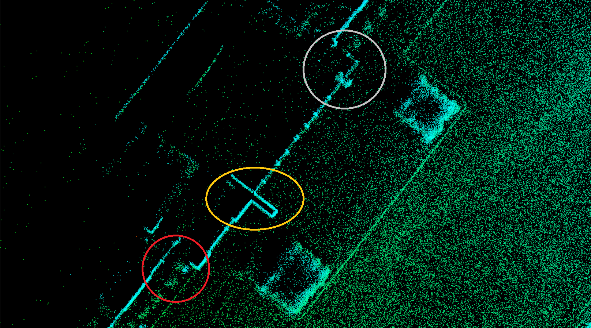
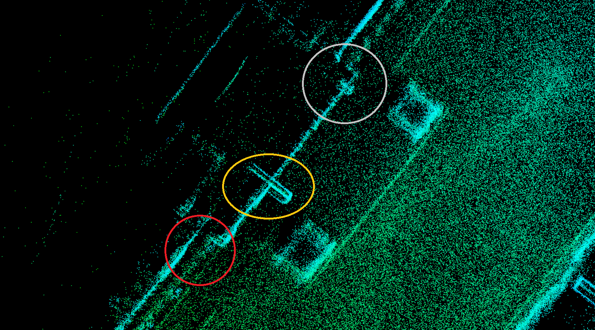

### How to Complete a Quality Inspection?

At present, you complete the quality verification manually with a visual inspection of the results. 

When the calibration is completed, the point cloud stitched during the calibration process is provided.  In the point cloud, details of the calibration field can be easily identified. Assess the calibration quality for clarity. Look at objects such as building facades, street lights, poles and road curbs.   If the point cloud is blurry and a ghosting effect can be found, the calibration is poor. If the calibration result is good, a sharp and clear stitched point cloud is shown.

Figure 1 shows the comparison between the stitched point clouds with good (a) and insufficient(b) calibration quality.

(a)

(b)

Figure 1 (a) a high quality calibration result (b) an insufficient one.

